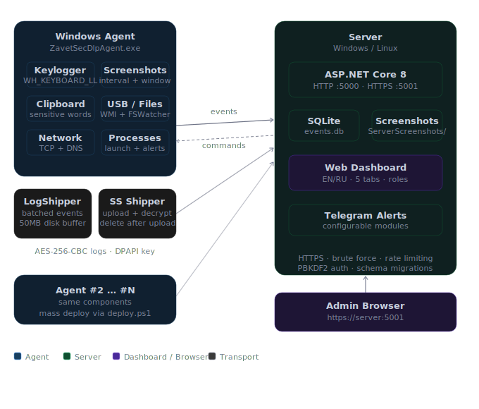

# ZavetSec DLP

<p align="center">
  
  
  
  
  
  
</p>

> ⚠️ **Legal Notice.** This software is intended exclusively for **authorized corporate use** — with written employee consent or under a company information security policy. The agent captures keystrokes, screenshots, and clipboard data. Unauthorized surveillance is illegal. By using this software you accept full legal responsibility for compliance with applicable laws.

---

**ZavetSec DLP** is a self-hosted **endpoint activity auditing** platform for insider threat monitoring and compliance. A lightweight Windows agent silently monitors endpoint activity and ships data to a central server with a real-time web dashboard. Built for IT security teams who need visibility into endpoints without relying on cloud vendors.

## Why ZavetSec DLP?

- **Fully self-hosted** — your data never leaves your infrastructure
- **Zero dependencies on endpoints** — single self-contained `.exe`, no .NET required on workstations
- **Designed to survive prolonged server outages** — persistent disk buffer (50 MB) with exponential backoff
- **Production-ready security** — brute force protection, rate limiting, HTTPS, PBKDF2 passwords, role-based access
- **Remote control** — start, stop, restart, or uninstall agents directly from the web dashboard
- **Multilingual** — English and Russian UI, switchable at runtime

---

## Table of Contents

- [Quick Start](#quick-start)
- [Installing from a Release](#installing-from-a-release-no-sdk-required)
- [Why ZavetSec DLP?](#why-zavetsec-dlp)
- [Threat Model](#threat-model)
- [Features](#features)
- [Architecture](#architecture)
- [Requirements](#requirements)
- [Step 1 — Build](#step-1--build)
- [Step 2 — Deploy the Server](#step-2--deploy-the-server)
- [Step 3 — Antivirus Exclusions](#step-3--antivirus-exclusions-required)
- [Step 4 — Install the Agent](#step-4--install-the-agent)
- [Configuration](#configuration)
- [Privacy Controls](#privacy-controls)
- [HTTPS](#https)
- [Authentication & Security](#authentication--security)
- [Reliable Event Delivery](#reliable-event-delivery)
- [Telegram Alerts](#telegram-alerts)
- [Dashboard](#dashboard)
- [Remote Agent Management](#remote-agent-management)
- [Uninstall Agent](#uninstall-agent)
- [API Reference](#api-reference)
- [Project Structure](#project-structure)
- [Troubleshooting](#troubleshooting)
- [Security Notes](#security-notes)
- [Intended Use](#intended-use)
- [Performance](#performance)
- [Known Limitations](#known-limitations)
- [Roadmap](#roadmap)
- [Changelog](#changelog)

---

## Quick Start

Get the server running and the first agent connected in under 10 minutes.

**1. Build both projects** (requires .NET 8 SDK):
```cmd
cd DlpServer && dotnet publish -c Release -o publish && cd ..
taskkill /IM ZavetSecDlpAgent.exe /F 2>nul
cd DlpAgent  && dotnet publish -c Release -o publish && cd ..
```

**2. Configure and start the server:**
```cmd
copy DlpServer\appsettings.example.json DlpServer\appsettings.json
:: Edit appsettings.json — set ApiKey and Certificate.Password
notepad DlpServer\appsettings.json

cd DlpServer\publish
dotnet DlpServer.dll
:: Dashboard: https://localhost:5001   Login: admin / admin
```

**3. Install the agent on a workstation** (run as Administrator):
```powershell
.\install.ps1 -ServerUrl "https://YOUR-SERVER:5001" -ApiKey "YOUR_KEY"
```

The agent appears in the **Agents** tab within ~30 seconds.
Default credentials: `admin` / `admin` — you will be forced to change the password on first login.

> See [Step 1 — Build](#step-1--build) through [Step 4 — Install the Agent](#step-4--install-the-agent) for the full deployment guide.

---

## Installing from a Release (no SDK required)

If you downloaded the pre-built binaries from the [Releases](../../releases) page,
you do not need the .NET SDK — only **.NET 8 Runtime** on the server.

### Server — DlpServer-publish.zip

```cmd
:: 1. Extract the archive to any folder, e.g. C:\DlpServer
mkdir C:\DlpServer
:: Extract DlpServer-publish.zip contents into C:\DlpServer

:: 2. Create config from template
copy C:\DlpServerppsettings.example.json C:\DlpServerppsettings.json
notepad C:\DlpServerppsettings.json
```

Set these two values in `appsettings.json`:
```json
"ApiKey": "any-random-string-32+chars",
"Password": "any-password-for-the-certificate"
```

```cmd
:: 3. Install .NET 8 Runtime if not already installed
::    https://dotnet.microsoft.com/download/dotnet/8.0
::    Download: ".NET Runtime 8.x" → Windows x64 Installer

:: 4. Start the server (first run auto-creates HTTPS certificate)
cd C:\DlpServer
dotnet DlpServer.dll

:: Dashboard: https://localhost:5001
:: Login: admin / admin  (you will be forced to change password)
```

> **Note:** The database (`events.db`) and certificate (`server.pfx`) are stored in
> `C:\ProgramData\ZavetSec\DLP\` — **outside** the install folder.
> You can safely replace `DlpServer.dll` and other files to upgrade without losing data.

### Agent — ZavetSecDlpAgent.exe

The agent is **fully self-contained** — no .NET Runtime needed on monitored workstations.

```powershell
:: Option A — automated install (run as Administrator)
:: Copy install.ps1 from the repo and ZavetSecDlpAgent.exe to the same folder, then:
.\install.ps1 -ServerUrl "https://YOUR-SERVER:5001" -ApiKey "YOUR_KEY"
```

```cmd
:: Option B — manual install (run as Administrator)

:: 1. Create install directory
mkdir C:\ProgramData\ZavetSec\Agent

:: 2. Copy the exe
copy ZavetSecDlpAgent.exe C:\ProgramData\ZavetSec\Agent
:: 3. Generate default config
cd C:\ProgramData\ZavetSec\Agent
ZavetSecDlpAgent.exe --console
:: Press Enter immediately to stop — config.json is now created

:: 4. Edit config — set serverUrl and apiKey
notepad config.json

:: 5. Register scheduled tasks
schtasks /create /tn "ZavetSec DLP Agent" ^
  /tr ""C:\ProgramData\ZavetSec\Agent\ZavetSecDlpAgent.exe" --task-mode" ^
  /sc ONLOGON /rl HIGHEST /f

schtasks /create /tn "ZavetSec DLP Agent Boot" ^
  /tr ""C:\ProgramData\ZavetSec\Agent\ZavetSecDlpAgent.exe" --task-mode" ^
  /sc ONSTART /ru SYSTEM /rl HIGHEST /f

:: 6. Start
schtasks /run /tn "ZavetSec DLP Agent"
```

> **Before deploying the agent:** add antivirus exclusions — see [Step 3 — Antivirus Exclusions](#step-3--antivirus-exclusions-required).

### Preparing a clean server archive for release

If you built the server yourself and want to share it, make sure no secrets are included:

```cmd
:: Remove secrets before archiving
del "DlpServer\publishppsettings.json"
del "DlpServer\publish\*.pfx"
:: Verify no database files
dir "DlpServer\publish\*.db"

:: Archive (only example config, no real keys)
powershell Compress-Archive -Path "DlpServer\publish\*" ^
  -DestinationPath "DlpServer-publish.zip"
```

---

## Features

| Module | Description |
|---|---|
| **Keystroke Monitor** | Low-level keyboard hook (WH_KEYBOARD_LL), layout-aware, dead keys, special keys |
| **Screenshots** | Interval capture + window-change trigger, blank screen detection, JPEG quality control |
| **Clipboard** | Monitors clipboard changes; alert on sensitive data (passwords, card numbers, passports) |
| **Network** | TCP connection monitoring on suspicious ports; DNS cache tracking |
| **USB** | WMI-based USB device detection; alert on removable media |
| **File Activity** | FileSystemWatcher on removable drives; alert on copy operations |
| **Processes** | Tracks process launches; alert on suspicious names (mimikatz, wireshark, etc.) |
| **Encryption** | Local logs encrypted with AES-256-CBC; key protected by Windows DPAPI (machine scope) |
| **Reliable Delivery** | Batched event shipping, 50 MB disk buffer when server is unreachable, exponential backoff |
| **HTTPS** | Self-signed certificate auto-generated on first run (RSA 2048, SHA-256, 10 years) |
| **Remote Control** | Start / Stop / Restart / Uninstall agents directly from the dashboard |
| **Agent Lifecycle Events** | `AGENT_ONLINE` on first connection, `AGENT_REMOVED` on dashboard removal, `AGENT_UNINSTALLED` on successful uninstall |
| **Unique Agent ID** | Each agent gets a persistent ID on first run — prevents conflicts when multiple machines share the same hostname |
| **Brute Force Protection** | IP blocked for 15 minutes after 5 failed login attempts |
| **Rate Limiting** | 1,000 requests/minute per IP on agent endpoints |
| **Telegram Alerts** | Configurable per-module notifications, rate-limited, filter by module type |
| **Role-Based Access** | `admin` (full) / `viewer` (read-only); forced password change on first login |
| **Multilingual UI** | English and Russian, switchable at runtime |

---

## Architecture



<details>
<summary>ASCII diagram — click to expand</summary>

```
┌────────────────────────────────────┐        ┌──────────────────────────────────┐
│    Windows Workstation             │        │    Server (Windows / Linux)      │
│                                    │ HTTPS  │                                  │
│  ZavetSecDlpAgent.exe              │───────▶│  DlpServer.dll (ASP.NET Core 8)  │
│  ├── KeyloggerMonitor              │        │  HTTP  :5000  ← agents           │
│  ├── ClipboardMonitor              │        │  HTTPS :5001  ← dashboard+agents │
│  ├── ScreenshotMonitor             │        │                                  │
│  ├── NetworkMonitor                │        │  POST /api/ingest                │
│  ├── UsbMonitor                    │◀───────│  GET  /api/commands/{host}       │
│  ├── FileActivityMonitor           │        │                                  │
│  ├── ProcessMonitor                │        │  Database: events.db (SQLite)    │
│  ├── LogShipper                    │        │  Screenshots: ServerScreenshots/ │
│  │   ├── Batched event delivery    │        │  Certificate: server.pfx (auto)  │
│  │   ├── 50 MB disk buffer         │        │                                  │
│  │   └── Exponential backoff       │        │  Dashboard: https://server:5001  │
│  ├── ScreenshotShipper             │        │  ├── Events + CSV export         │
│  └── CommandPoller (heartbeat)     │        │  ├── Screenshots                 │
│                                    │        │  ├── Keylogger                   │
│  C:\ProgramData\ZavetSec\DLP\      │        │  ├── Agents (paginated, control) │
│  ├── Logs\*.log (AES-256)          │        │  └── Management (users, TG)      │
│  ├── Screenshots\ (temporary)      │        │                                  │
│  ├── shipper_queue.dat (buffer)    │        │  Security:                       │
│  └── agent.key (DPAPI)             │        │  ├── Brute force protection      │
└────────────────────────────────────┘        │  ├── Rate limiting               │
                                              │  └── Session invalidation        │
                                              └──────────────────────────────────┘
```

</details>

---

## Threat Model

ZavetSec DLP is designed to detect and audit the following threat categories:

| Threat | Detection Mechanism |
|---|---|
| Insider data theft | USB activity, file copy to removable drives, clipboard exfiltration |
| Credential leakage | Clipboard monitoring with configurable sensitive word detection |
| Shadow IT / unauthorized tools | Process monitoring with suspicious name list |
| Remote access abuse | Network monitoring on alert ports (RDP 3389, VNC 5900, etc.) |
| Suspicious DNS activity | DNS cache tracking, alert on new/unknown domains |
| Malware execution | Process launch auditing (mimikatz, nc, psexec, procdump, etc.) |
| Physical media exfiltration | USB device detection, removable media alerts |
| Unauthorized access | Screenshot capture on window change, keylogger activity timeline |

ZavetSec DLP provides **detection and audit capability**, not active blocking. It is designed for post-incident investigation, compliance logging, and real-time alerting — not endpoint protection.

---

## Requirements

**Agent:**
- Windows 10 / Windows Server 2016+ (x64)
- Administrator privileges
- .NET 8 Runtime — **or** use the self-contained build (recommended — no .NET required on endpoints)

**Server:**
- Windows or Linux Ubuntu 22.04+
- .NET 8 Runtime
- Minimum 1 GB RAM, 20+ GB disk

---

## Step 1 — Build

Run once on your development machine.

### Server

```cmd
cd DlpServer
dotnet publish -c Release -o publish
```

### Agent

```cmd
:: Stop the agent first if it is running — otherwise the build will fail
:: (the running process locks the .exe file)
taskkill /IM ZavetSecDlpAgent.exe /F 2>nul

cd DlpAgent
dotnet publish -c Release -o publish
```

Output: `DlpAgent\publish\ZavetSecDlpAgent.exe` (~60 MB, self-contained — no .NET required on target machines).

> When code changes: stop the agent, rebuild, copy the new exe to the install folder, restart.

---

## Step 2 — Deploy the Server

### Windows

**Step A — Configure before first run:**

```cmd
:: Copy the example config
copy DlpServer\appsettings.example.json DlpServer\appsettings.json

:: Edit it — fill in ApiKey and Certificate Password
notepad DlpServer\appsettings.json
```

Mandatory values to set:
- `DlpServer.ApiKey` — any random string, 32+ characters
- `Kestrel.Endpoints.Https.Certificate.Password` — any password for the auto-generated certificate

> **Note:** If you change the certificate password after the server has already run,
> you must delete `C:\ProgramData\ZavetSec\DLP\server.pfx` before restarting —
> otherwise Kestrel will fail to load the old certificate with the new password.

Generate a random key in PowerShell:
```powershell
[System.Convert]::ToBase64String(
  [System.Security.Cryptography.RandomNumberGenerator]::GetBytes(32)
)
```

**Step B — Run the server:**

```cmd
cd DlpServer\publish
dotnet DlpServer.dll
```

Expected output on first run:
```
[HTTPS] Self-signed certificate created: C:\ProgramData\ZavetSec\DLP\server.pfx
[HTTPS] Valid until: 2036-05-19
DLP Server started. DB=C:\ProgramData\ZavetSec\DLP\events.db
HTTP  → http://0.0.0.0:5000
HTTPS → https://0.0.0.0:5001 (self-signed cert)
```

### Windows — Install as a Service

```cmd
sc create ZavetSecDlpServer ^
  binPath="dotnet C:\DlpServer\publish\DlpServer.dll" ^
  start=auto DisplayName="ZavetSec DLP Server"
sc start ZavetSecDlpServer
```

<details>
<summary>Linux (systemd) — click to expand</summary>

```bash
# Install .NET 8
wget https://dot.net/v1/dotnet-install.sh && chmod +x dotnet-install.sh
./dotnet-install.sh --channel 8.0 --install-dir /usr/share/dotnet
ln -sf /usr/share/dotnet/dotnet /usr/bin/dotnet

# Copy files
mkdir -p /opt/dlpserver
scp -r DlpServer/publish/* user@server:/opt/dlpserver/

# Create systemd service
cat > /etc/systemd/system/dlpserver.service << 'EOF'
[Unit]
Description=ZavetSec DLP Server
After=network.target

[Service]
Type=simple
User=root
WorkingDirectory=/opt/dlpserver
ExecStart=/usr/bin/dotnet /opt/dlpserver/DlpServer.dll
Restart=always
RestartSec=5

[Install]
WantedBy=multi-user.target
EOF

systemctl daemon-reload && systemctl enable --now dlpserver
```

</details>

### Firewall

```bash
# Linux
ufw allow 5000/tcp && ufw allow 5001/tcp

# Windows
netsh advfirewall firewall add rule name="ZavetSec HTTP"  protocol=TCP dir=in localport=5000 action=allow
netsh advfirewall firewall add rule name="ZavetSec HTTPS" protocol=TCP dir=in localport=5001 action=allow
```

### Upgrading the Server

```cmd
:: Stop server → replace publish\ files → start
:: appsettings.json and events.db are preserved (they live outside publish\)
```

> On startup the server automatically applies all pending database schema migrations.
> Existing data is preserved — upgrades are safe.

---

## Step 3 — Antivirus Exclusions (Required)

The agent uses a keyboard hook and captures screenshots. Antivirus engines detect this behavior as `PDM:Trojan`. **Add exclusions before copying the agent to endpoints.**

### Windows Defender (PowerShell as Administrator)

```powershell
Add-MpPreference -ExclusionPath    "C:\ProgramData\ZavetSec"
Add-MpPreference -ExclusionProcess "ZavetSecDlpAgent.exe"
```

### Group Policy (recommended for domain environments)

```
Group Policy Management →
  Computer Configuration → Administrative Templates →
    Windows Components → Windows Defender Antivirus →
      Exclusions → Path Exclusions:
        C:\ProgramData\ZavetSec\Agent\ZavetSecDlpAgent.exe
        C:\ProgramData\ZavetSec\DLP\
```

### Kaspersky (via Kaspersky Security Center)

```
Policies → File Threat Protection → Exclusions:
  Path: C:\ProgramData\ZavetSec\Agent\ZavetSecDlpAgent.exe
  Scope: All protection components
```

---

## Step 4 — Install the Agent

### Manual Installation (single machine)

```cmd
:: 1. Add antivirus exclusion (Step 3)

:: 2. Copy agent files
mkdir C:\ProgramData\ZavetSec\Agent
xcopy /E /I DlpAgent\publish\* C:\ProgramData\ZavetSec\Agent\

:: 3. First run creates config.json with defaults
cd C:\ProgramData\ZavetSec\Agent
ZavetSecDlpAgent.exe --console
:: Press Enter to stop

:: 4. Edit config.json — fill in the "shipper" section
notepad config.json
```

In `config.json` set the `shipper` section:
```json
"shipper": {
  "enabled": true,
  "serverUrl": "https://YOUR-SERVER-IP:5001",
  "apiKey": "YOUR_KEY_FROM_APPSETTINGS",
  "batchSize": 50,
  "flushSeconds": 30,
  "maxQueueSize": 5000,
  "deleteLocalScreenshotsAfterUpload": true,
  "allowInvalidCertificate": true
}
```

```cmd
:: 5. Register scheduled tasks
::
::    ONLOGON — runs as the logged-in user (required for screenshot access)
::              Windows Session 0 Isolation prevents SYSTEM from capturing the desktop
schtasks /create /tn "ZavetSec DLP Agent" ^
  /tr "\"C:\ProgramData\ZavetSec\Agent\ZavetSecDlpAgent.exe\" --task-mode" ^
  /sc ONLOGON /rl HIGHEST /f

::    ONSTART — runs as SYSTEM for boot persistence (no desktop needed at boot)
schtasks /create /tn "ZavetSec DLP Agent Boot" ^
  /tr "\"C:\ProgramData\ZavetSec\Agent\ZavetSecDlpAgent.exe\" --task-mode" ^
  /sc ONSTART /ru SYSTEM /rl HIGHEST /f

:: 6. Start immediately
schtasks /run /tn "ZavetSec DLP Agent"
```

> **Important:** The ONLOGON task must run as the interactive logged-in user, **not** as SYSTEM.
> Windows Vista+ Session 0 Isolation prevents SYSTEM processes from accessing the user's desktop,
> which causes `Graphics.CopyFromScreen` to fail with "Invalid Handle".
> The ONSTART task can run as SYSTEM because no desktop capture happens at boot time.

The agent will appear in the Agents tab within ~30 seconds.

### install.ps1 (single machine, automated)

```powershell
# Run as Administrator. The publish\ folder must be in the same directory as the script.
.\install.ps1 -ServerUrl "https://dlp.company.com:5001" -ApiKey "YOUR_KEY"
```

<details>
<summary>deploy.ps1 — mass deployment via WinRM (click to expand)</summary>

```powershell
# Enable WinRM on target machines (or via GPO):
winrm quickconfig -force

# Deploy from a list
.\deploy.ps1 -Computers (Get-Content .\machines.txt) `
             -ServerUrl "https://dlp.company.com:5001" `
             -ApiKey "YOUR_KEY" `
             -ConcurrentJobs 10

# Deploy to all machines in an Active Directory OU
$pcs = (Get-ADComputer -Filter * `
        -SearchBase "OU=Workstations,DC=company,DC=local").Name
.\deploy.ps1 -Computers $pcs -ServerUrl "https://..." -ApiKey "YOUR_KEY"
```

</details>

---

## Configuration

### Server — appsettings.json

```json
{
  "DlpServer": {
    "ApiKey": "REPLACE_WITH_RANDOM_32+_CHAR_KEY",
    "DbPath": "C:\\ProgramData\\ZavetSec\\DLP\\events.db",
    "ScreenshotDir": "C:\\ProgramData\\ZavetSec\\DLP\\ServerScreenshots",
    "MaxEventsReturn": 500
  },
  "Telegram": {
    "BotToken": "",
    "ChatId": "",
    "SendAllAlerts": false,
    "AlertModules": [
      "USB_ALERT", "USB_CONNECT", "CLIPBOARD_ALERT",
      "PROCESS_ALERT", "DNS_ALERT", "FILE_ALERT"
    ]
  },
  "Kestrel": {
    "Endpoints": {
      "Http":  { "Url": "http://0.0.0.0:5000" },
      "Https": {
        "Url": "https://0.0.0.0:5001",
        "Certificate": {
          "Path": "C:\\ProgramData\\ZavetSec\\DLP\\server.pfx",
          "Password": "REPLACE_WITH_RANDOM_PASSWORD"
        }
      }
    }
  }
}
```

### Agent — config.json

```json
{
  "screenshot": {
    "intervalMinutes": 5,
    "jpegQuality": 75,
    "onWindowChange": true,
    "onStartup": true,
    "windowCheckIntervalSeconds": 1,
    "blankScreenDetection": true
  },
  "keylogger": {
    "enabled": true,
    "bufferChars": 512,
    "flushSeconds": 30
  },
  "clipboard": {
    "enabled": true,
    "pollIntervalMs": 500,
    "maxContentLength": 4096,
    "sensitiveWords": [
      "password", "passwd", "secret", "token",
      "private key", "confidential", "credit", "ssn"
    ]
  },
  "network": {
    "enabled": true,
    "connectionCheckSeconds": 10,
    "dnsCheckSeconds": 30,
    "alertPorts": [22, 23, 3389, 4444, 5900, 6667]
  },
  "storage": {
    "logDir": "C:\\ProgramData\\ZavetSec\\DLP\\Logs",
    "screenshotDir": "C:\\ProgramData\\ZavetSec\\DLP\\Screenshots",
    "keyFile": "C:\\ProgramData\\ZavetSec\\DLP\\agent.key",
    "retentionLogDays": 30,
    "retentionScreenshotDays": 7,
    "maxLogMb": 500,
    "maxScreenshotMb": 2048
  },
  "processes": {
    "enabled": true,
    "checkIntervalSeconds": 10,
    "whitelist": ["svchost", "csrss", "lsass", "explorer", "dwm", "winlogon"],
    "suspiciousProcesses": ["mimikatz", "wireshark", "nc", "nmap", "psexec", "procdump"]
  },
  "shipper": {
    "enabled": true,
    "serverUrl": "https://YOUR-SERVER:5001",
    "apiKey": "YOUR_KEY",
    "batchSize": 50,
    "flushSeconds": 30,
    "maxQueueSize": 5000,
    "deleteLocalScreenshotsAfterUpload": true,
    "allowInvalidCertificate": true
  }
}
```

| Parameter | Description |
|---|---|
| `shipper.enabled` | Enable event delivery to server |
| `shipper.flushSeconds` | Batch send interval and command poll interval (heartbeat) |
| `shipper.maxQueueSize` | Max events in memory before spilling to disk |
| `shipper.deleteLocalScreenshotsAfterUpload` | Delete local screenshot file after successful upload |
| `shipper.allowInvalidCertificate` | Accept self-signed HTTPS certificates |
| `shipper.agentId` | Unique agent identifier — **auto-generated on first run**, do not edit manually |
| `storage.retentionLogDays` | Days to keep local encrypted logs |
| `clipboard.sensitiveWords` | Words that trigger CLIPBOARD_ALERT |
| `network.alertPorts` | TCP ports that trigger NETWORK_ALERT |

---

## Privacy Controls

All monitoring modules are independently configurable per deployment. Administrators can disable any module by editing `config.json` on the agent before deployment.

| Module | Disable by setting |
|---|---|
| Keystroke monitoring | `"keylogger": { "enabled": false }` |
| Screenshot capture | `"screenshot": { "intervalMinutes": 0, "onWindowChange": false, "onStartup": false }` |
| Clipboard monitoring | `"clipboard": { "enabled": false }` |
| Network monitoring | `"network": { "enabled": false }` |
| Process monitoring | `"processes": { "enabled": false }` |
| USB / file monitoring | Modules can be excluded from `DlpService` initialization |
| Telegram alerts | Leave `BotToken` empty in `appsettings.json` |

**Data retention** is controlled server-side. Screenshots and events can be deleted per-host or globally from the Management tab. Automated retention is configured via `retentionLogDays` and `retentionScreenshotDays` in `config.json`.

> Organizations should document which modules are active and communicate this to employees as required by local employment law and privacy regulations.

---

## HTTPS

### Self-Signed Certificate (automatic)

On first startup the server creates `server.pfx`:
- RSA 2048 + SHA-256, valid for 10 years
- SAN includes: `localhost`, machine hostname, `127.0.0.1`

The agent connects with `"allowInvalidCertificate": true`. The browser will show a warning — click "Advanced → Proceed" once.

> ⚠️ **Security note:** `allowInvalidCertificate: true` disables certificate validation and makes the agent vulnerable to Man-in-the-Middle attacks on untrusted networks. For production deployments on external or untrusted networks, use a trusted certificate from a corporate CA or Let's Encrypt, or implement certificate fingerprint pinning (on the roadmap). For internal corporate LAN deployments the self-signed certificate provides encryption without MITM risk from external attackers.

The server logs a warning if the default certificate password is detected:
```
[SECURITY] WARNING: Using default certificate password.
```

### Replace the Certificate Password

Edit `appsettings.json` → `Kestrel.Endpoints.Https.Certificate.Password`, then delete the old `.pfx` file and restart:

```cmd
del "C:\ProgramData\ZavetSec\DLP\server.pfx"
dotnet DlpServer.dll
:: A new certificate is created with the new password
```

### Use a Trusted Certificate (Let's Encrypt / Corporate CA)

```json
"Certificate": {
  "Path": "C:\\certs\\company.pfx",
  "Password": "cert_password"
}
```

No changes needed on the agent side if the certificate is from a trusted CA.

---

## Authentication & Security

### First Login

```
Username: admin
Password: admin
```

On first login the system **forces a password change** — the dashboard is blocked until the password is updated.

### Password Policy

- Minimum **12 characters**
- Must contain uppercase letters (A-Z)
- Must contain lowercase letters (a-z)
- Must contain digits (0-9)
- Must contain special characters (`!@#$%^` etc.)

Enforced on both server and client side.

### Roles

| Role | Permissions |
|---|---|
| `admin` | Full access: view data, manage agents, manage users, delete data, Telegram settings |
| `viewer` | Read-only: events, screenshots, keylogger, agent status. No control buttons |

### Brute Force Protection

- **5 failed attempts** from one IP → **15-minute lockout**
- A countdown timer is shown on the login page
- Successful login resets the counter
- Old records are automatically cleaned up every 5 minutes

### Rate Limiting

- Agent endpoints: **1,000 requests/minute** per IP
- Exceeded → HTTP 429 with `Retry-After: 60` header

### Session Invalidation

- Changing a password (own or another user's via admin) immediately invalidates **all sessions** for that user
- Active sessions receive HTTP 401 on the next request

### Password Storage

PBKDF2-SHA256, 100,000 iterations, 16-byte salt. Session tokens: 32 cryptographically random bytes (hex), 24-hour TTL with sliding expiry.

---

## Reliable Event Delivery

The agent guarantees data delivery even when the server is unreachable for extended periods:

```
Server unreachable
        │
        ▼
In-memory queue (maxQueueSize events)
        │ queue full
        ▼
Disk buffer (shipper_queue.dat, up to 50 MB)
        │ disk buffer full
        ▼
Oldest 10% of records trimmed (FIFO)

On server recovery:
  1. Agent restarts → LoadPersistedQueue()
  2. Buffer file loaded into memory
  3. Buffer file deleted
  4. Delivery resumes
```

**Exponential backoff on delivery failures:**

| Attempt | Wait |
|---|---|
| 1 | 30 s |
| 2 | 60 s |
| 3 | 120 s |
| 4 | 240 s |
| … | … |
| 6+ | 30 min (max) |

---

## Telegram Alerts

### Setup

1. Create a bot via [@BotFather](https://t.me/BotFather) → `/newbot` → get `BotToken`
2. Message your bot, open `https://api.telegram.org/bot{TOKEN}/getUpdates` → find `chat.id`
3. Set in `appsettings.json`:

```json
"Telegram": {
  "BotToken": "123456789:ABC-DEF...",
  "ChatId": "-100123456789"
}
```

### Alert Filters

**Specific modules only** (default):
```json
"SendAllAlerts": false,
"AlertModules": ["USB_ALERT", "CLIPBOARD_ALERT", "PROCESS_ALERT", "DNS_ALERT"]
```

**All alerts without filter:**
```json
"SendAllAlerts": true
```

Restart the server after changing config. Use the **Send test** button in the dashboard (Management tab).

**Rate limit:** at most 1 notification per 30 seconds per host+module pair.

---

## Dashboard

Open at: `https://YOUR-SERVER:5001`

Language toggle (EN/RU) is in the top-right header. Preference is saved per browser.  
Auto-refresh every 30 seconds. Timestamps shown in the browser's local timezone.

### Events Tab

- Filters: module, host, date range, full-text search
- Selecting a different host or module in the dropdown **auto-applies** the filter immediately
- Enter key in any filter field = instant apply
- Date picker change = instant apply
- **⬇ CSV** button — exports up to 100,000 rows with current filters; progress shown in KB as it streams; UTF-8 BOM included for correct Excel display

> **Agent lifecycle events** appear in the Events tab with special modules:
> `AGENT_ONLINE` (first heartbeat from a new agent), `AGENT_REMOVED` (removed from dashboard),
> `AGENT_UNINSTALLED` (agent confirmed self-removal). User is shown as `system`.

**Color coding:**

| Color | Modules |
|---|---|
| 🔴 Red | `*_ALERT`, `*_ERROR` |
| 🟣 Purple | `KEYLOGGER` |
| 🔵 Cyan | `CLIPBOARD` |
| 💙 Blue | `SCREENSHOT` |
| 🟢 Green | `NETWORK_*`, `DNS_*` |
| 🟡 Yellow | `USB_*`, `FILE_*` |
| 🩷 Pink | `PROCESS_*` |

### Screenshots Tab

- Grid view with process name and window title
- Case-insensitive search (supports all Unicode)
- Click → full-size modal with metadata
- **Delete** button in modal (admin only)
- **Multi-select mode**: checkboxes, select all on page, bulk delete

### Keystroke Monitor Tab

- Sessions grouped by active window
- Full-text search with match highlighting
- Special keys displayed as: `[BS]` `[TAB]` `[CTRL+C]` `[WIN]`

### Agents Tab

- Cards showing Online/Offline status, **20 agents per page**
- Online = last heartbeat less than 2 minutes ago (updated on every poll cycle)
- Admin buttons: Restart / Stop / Uninstall — available for both Online and Offline agents
- Offline-only: Remove from list (removes from dashboard without uninstalling)
- Per-host data: 📷 Screenshots / 📋 Events — delete server data for that host
- Broadcast panel — send commands to all agents at once
- Server data management panel (admin only)
- DB size and screenshot disk usage (admin only)

### Audit Log Tab (admin only)

- Chronological log of all admin actions: logins, logouts, data deletions, commands sent, user management
- Color-coded by action type: DELETE (red), CREATE/LOGIN (green), COMMAND (yellow), PASSWORD (purple)
- Full-text search across action, target, and admin username
- Pagination (100 records per page)

### Management Tab (admin only)

- Create / delete users
- Password status column (OK / Change password)
- Change your own password
- Telegram: connection status, configured alert modules, send test notification

---

## Remote Agent Management

Commands are delivered on the agent's next poll cycle (~`flushSeconds` seconds).

| Command | Action |
|---|---|
| **Start** | Start monitoring (if agent process is alive) |
| **Stop** | Stop monitoring (process stays alive) |
| **Restart** | Full restart |
| **Uninstall** | Remove: scheduled tasks, exe, Logs\, Screenshots\, encryption key |

> Uninstall does **not** delete `events.db` or server screenshots — data is preserved on the server.

---

## Uninstall Agent

### Remotely via Dashboard

Agents tab → **✕ Uninstall** → confirm. Agent self-removes in ~30 seconds.

### Manually on the Machine

```cmd
taskkill /IM ZavetSecDlpAgent.exe /F
schtasks /delete /tn "ZavetSec DLP Agent"      /f
schtasks /delete /tn "ZavetSec DLP Agent Boot" /f
rd /s /q "C:\ProgramData\ZavetSec\DLP\Logs"
rd /s /q "C:\ProgramData\ZavetSec\DLP\Screenshots"
del /f   "C:\ProgramData\ZavetSec\DLP\agent.key"
del /f   "C:\ProgramData\ZavetSec\DLP\shipper_queue.dat"
del /f   "C:\ProgramData\ZavetSec\Agent\ZavetSecDlpAgent.exe"
```

### Mass Uninstall via PowerShell

```powershell
$computers = Get-Content .\machines.txt
foreach ($pc in $computers) {
    Invoke-Command -ComputerName $pc -ScriptBlock {
        taskkill /IM ZavetSecDlpAgent.exe /F 2>$null
        schtasks /delete /tn "ZavetSec DLP Agent"      /f 2>$null
        schtasks /delete /tn "ZavetSec DLP Agent Boot" /f 2>$null
        Remove-Item "C:\ProgramData\ZavetSec\Agent" -Recurse -Force -EA SilentlyContinue
        Remove-Item "C:\ProgramData\ZavetSec\DLP\Logs" -Recurse -Force -EA SilentlyContinue
        Write-Host "$env:COMPUTERNAME removed"
    } -ErrorAction SilentlyContinue
}
```

---

## API Reference

<details>
<summary>Full API reference — click to expand</summary>


### Agent Endpoints (header: `X-Api-Key`)

| Method | Path | Description | Rate Limit |
|---|---|---|---|
| POST | `/api/ingest` | Batch event submission (max 1,000) | 1,000/min/IP |
| POST | `/api/screenshots/upload` | Upload screenshot | 1,000/min/IP |
| GET  | `/api/commands/{host}` | Fetch pending commands + heartbeat | 1,000/min/IP |
| POST | `/api/commands/result` | Report command execution result | 1,000/min/IP |

### Dashboard Endpoints (header: `Authorization: Bearer {token}`)

| Method | Path | Description | Role |
|---|---|---|---|
| GET  | `/api/events` | Filtered event list | viewer+ |
| GET  | `/api/export/events.csv` | CSV export up to 100k rows (UTF-8 BOM) | viewer+ |
| GET  | `/api/screenshots` | Screenshot list with filters | viewer+ |
| GET  | `/api/screenshots/{id}/image` | Screenshot image file (public) | — |
| DELETE | `/api/screenshots/{id}` | Delete screenshot | admin |
| GET  | `/api/stats` | Statistics + disk usage | viewer+ |
| GET  | `/api/hosts` | Known host list | viewer+ |
| GET  | `/api/agents` | Agent statuses (online/offline) | viewer+ |
| POST | `/api/commands` | Send command to agent | admin |
| GET  | `/api/commands/history` | Command history | viewer+ |
| DELETE | `/api/agents/{host}` | Remove agent from list | admin |
| DELETE | `/api/data/{host}/screenshots` | Delete host screenshots | admin |
| DELETE | `/api/data/{host}/events` | Delete host events | admin |
| DELETE | `/api/data/all/screenshots` | Delete all screenshots | admin |
| DELETE | `/api/data/all/events` | Delete all events | admin |
| GET  | `/health` | Health check: status, DB, uptime (public) | — |
| GET  | `/api/audit` | Admin audit log (delete/command/user actions) | admin |

### Auth Endpoints

| Method | Path | Description |
|---|---|---|
| POST | `/api/auth/login` | Login → `{token, username, role, mustChangePassword}` |
| POST | `/api/auth/logout` | Logout, delete session |
| GET  | `/api/auth/me` | Current user info |
| POST | `/api/auth/change-password` | Change password + invalidate all sessions |

### User Management (admin only)

| Method | Path | Description |
|---|---|---|
| GET    | `/api/users` | List users |
| POST   | `/api/users` | Create user |
| DELETE | `/api/users/{username}` | Delete user + their sessions |

### Telegram

| Method | Path | Description |
|---|---|---|
| GET | `/api/telegram/test` | Send test notification |
| GET | `/api/telegram/config` | Current filter configuration |

---

</details>

## Project Structure

```
zavetsec-dlp/
│
├── DlpAgent/
│   ├── DlpAgent.csproj         net8.0-windows, self-contained, WinForms
│   ├── Program.cs              Entry point: --task-mode / --console / SCM
│   ├── DlpService.cs           Module coordinator
│   ├── Config.cs               config.json loader, all settings including ShipperConfig
│   ├── Logger.cs               AES-256-CBC + DPAPI, Write() / WriteLocal()
│   ├── LogShipper.cs           Batch delivery, disk buffer, exponential backoff
│   ├── CommandPoller.cs        Remote commands + heartbeat, lazy HttpClient
│   ├── NativeHelpers.cs        Win32: windows, user, keyboard layout
│   ├── KeyloggerMonitor.cs     WH_KEYBOARD_LL hook
│   ├── ClipboardMonitor.cs     Clipboard monitoring + alerts
│   ├── ScreenshotMonitor.cs    Screen capture + encryption
│   ├── ScreenshotShipper.cs    Upload screenshots, delete local copies
│   ├── NetworkMonitor.cs       TCP + DNS monitoring
│   ├── UsbMonitor.cs           WMI USB device events
│   ├── FileActivityMonitor.cs  FileSystemWatcher on removable drives
│   ├── ProcessMonitor.cs       Process launch tracking
│   └── RetentionManager.cs     Automatic cleanup of old files
│
├── DlpServer/
│   ├── DlpServer.csproj        net8.0, Minimal API, SQLite
│   ├── Program.cs              Routes, auth middleware, brute force, rate limit, HTTPS cert
│   ├── EventStore.cs           SQLite: all tables, auth, migrations, password validation
│   ├── Models.cs               All data models
│   ├── TelegramNotifier.cs     Alerts, rate-limit, per-module filters
│   ├── appsettings.json        Runtime config (excluded from git — use example)
│   ├── appsettings.example.json  Template without secrets
│   └── wwwroot/
│       └── index.html          SPA dashboard: 6 tabs, EN/RU i18n, vanilla JS
│
├── install.ps1                 Single-machine agent installer
├── deploy.ps1                  Mass deployment via WinRM
├── .gitignore                  Excludes *.pfx, *.db, *.key, publish/, appsettings.json
├── CHANGELOG.md                Version history
└── README.md
```

---

## Security Summary

| Component | Mechanism |
|---|---|
| Passwords | PBKDF2-SHA256, 100,000 iterations, 16-byte salt |
| Sessions | 32-byte random token, 24h TTL with sliding expiry |
| Password change | Immediate invalidation of all user sessions |
| Brute force | 5 failed attempts per IP → 15-minute lockout |
| Rate limiting | 1,000 requests/minute per IP on agent endpoints |
| Transport | HTTPS, self-signed RSA-2048 certificate |
| Local logs | AES-256-CBC, key in Windows DPAPI machine scope |
| API auth | `X-Api-Key` (agents) + Bearer token (dashboard) |
| API key model | Shared key for all agents — see [Roadmap](#roadmap) for per-agent auth |
| Role model | admin / viewer enforced on every endpoint |
| DB migrations | Versioned schema (`schema_version` table) |
| Admin audit log | All destructive actions logged: delete events/screenshots, commands, user management |

---

## Troubleshooting

### Screenshots not appearing in dashboard

**Symptom:** `SCREENSHOT` events appear in the Events tab but nothing in the Screenshots tab.

**Cause:** The ONLOGON scheduled task is running as SYSTEM instead of the logged-in user.

**Fix:** Recreate the task without `/ru SYSTEM`:
```cmd
taskkill /IM ZavetSecDlpAgent.exe /F
schtasks /delete /tn "ZavetSec DLP Agent" /f
schtasks /create /tn "ZavetSec DLP Agent" ^
  /tr "\"C:\ProgramData\ZavetSec\Agent\ZavetSecDlpAgent.exe\" --task-mode" ^
  /sc ONLOGON /rl HIGHEST /f
schtasks /run /tn "ZavetSec DLP Agent"
```

### `SCREENSHOT_ERROR: Win32Exception: Invalid Handle`

Same root cause as above — agent is running as SYSTEM with no access to the user's desktop session (Windows Session 0 Isolation). Apply the fix above.

### Server fails with `CryptographicException: Wrong password`

The certificate file `server.pfx` was created with a different password than the one in `appsettings.json`.

**Fix:**
```cmd
del "C:\ProgramData\ZavetSec\DLP\server.pfx"
:: Update appsettings.json with the correct password, then restart
dotnet DlpServer.dll
```

### Agent events arrive but screenshots do not upload

Verify the agent's `config.json` has `shipper` section with all required fields:
```json
"shipper": {
  "enabled": true,
  "serverUrl": "https://YOUR-SERVER:5001",
  "apiKey": "SAME_KEY_AS_APPSETTINGS",
  "allowInvalidCertificate": true
}
```

Check `allowInvalidCertificate` is `true` when using the self-signed certificate.

### Build fails: `cannot access ZavetSecDlpAgent.exe — used by another process`

The agent is running and locking the exe file. Stop it before rebuilding:
```cmd
taskkill /IM ZavetSecDlpAgent.exe /F
dotnet publish -c Release -o publish
```

### Agent not connecting to server

1. Verify the server is running: `https://SERVER-IP:5001/health` should return `{"status":"healthy"}`
2. Verify `apiKey` in agent `config.json` matches `DlpServer.ApiKey` in `appsettings.json`
3. Verify `serverUrl` uses the correct IP and port (`5001` for HTTPS, `5000` for HTTP)
4. Check firewall: ports 5000 and 5001 must be open on the server

---

## Security Notes

ZavetSec DLP is a monitoring tool, not a remote access framework. The following boundaries are by design:

- **No remote shell** — the command system supports only: start, stop, restart, uninstall. No arbitrary code execution.
- **No privilege escalation** — the agent runs as the logged-in user or SYSTEM (for boot persistence only). It does not attempt to elevate privileges beyond what the scheduled task grants.
- **No lateral movement** — the agent communicates only with the configured `serverUrl`. No peer-to-peer, no broadcast.
- **No persistence outside scheduled tasks** — removal is clean: delete the scheduled task and the install folder.
- **Encrypted local logs** — all local logs are AES-256-CBC encrypted. Without the machine-specific DPAPI key, captured data is unreadable even if the disk is removed.
- **API key required** — all agent→server communication requires a pre-shared API key. The server rejects unauthenticated requests with HTTP 401.
- **Self-hosted only** — no cloud component, no telemetry, no license server.

> If you discover a security issue in ZavetSec DLP, please open a private GitHub Security Advisory rather than a public issue.

---

## Intended Use

ZavetSec DLP is designed for:

- **Corporate insider threat monitoring** — detect data exfiltration, policy violations, unauthorized access
- **Compliance and auditing** — maintain activity records for regulated environments (finance, healthcare, legal)
- **Incident response and investigation** — reconstruct endpoint activity after a security incident
- **IT security operations** — visibility into what happens on managed workstations

**Not intended for:**

- Covert surveillance of individuals without their knowledge in jurisdictions where this is illegal
- Consumer spyware or personal relationship monitoring
- Bypassing OS security mechanisms or endpoint protection

> The deploying organization is solely responsible for ensuring compliance with applicable laws,
> employment agreements, and privacy regulations (GDPR, HIPAA, local labor law, etc.).

---

## Performance

Typical resource usage on a monitored workstation (measured on Windows 10, idle desktop):

| Resource | Typical usage |
|---|---|
| RAM | 40–90 MB |
| CPU (idle) | < 1% |
| CPU (screenshot capture) | 2–5% spike, < 1 second |
| Disk I/O | Low burst writes; logs flushed every 30 seconds |
| Network (events) | Batched POST every `flushSeconds` (default: 30 s); ~1–5 KB per batch |
| Network (screenshots) | 50–300 KB per image depending on JPEG quality and screen content |

**Server-side** (single server, 50 agents):
- RAM: ~150–300 MB
- Disk: grows with retention settings; ~500 MB/day for 50 active agents with screenshots
- SQLite handles up to ~50 GB comfortably; beyond that, consider archiving old events

---

## Known Limitations

- **Shared API key** — all agents use the same API key; each agent has a unique `agentId` for identification, but key-level revocation requires rotating the key for all agents. Per-agent keys are on the roadmap
- **No certificate pinning** — `allowInvalidCertificate: true` accepts any server certificate; fingerprint pinning is on the roadmap
- Agent captures the **primary display only** (multi-monitor: screen 0 only)
- No **code signing** certificate — Windows Defender behavioral detection requires an exclusion
- SQLite is not recommended above ~50 GB database size
- Self-signed HTTPS certificate shows a browser warning (expected — click "Proceed")

---

## Roadmap

Community contributions and pull requests are welcome.

### Security (high priority)

- [ ] **Per-agent authentication** — unique API key per agent with server-side revocation; currently all agents share one key (if one agent's config is compromised, the key must be rotated on all agents)
- [ ] **Certificate fingerprint pinning** — instead of `allowInvalidCertificate: true`, agents verify the server certificate by its SHA-256 fingerprint; eliminates MITM risk on untrusted networks
- [ ] **Event integrity chain** — HMAC chaining of event batches for tamper-evident forensic logs
- [ ] **Code signing** — signed agent binary to eliminate Windows Defender exclusion requirement
- [ ] **Explicit consent logging** — employee acknowledgement artifact storage for GDPR compliance

### Features

- [ ] **Multi-monitor screenshots** — capture all screens, not just screen 0
- [ ] **PostgreSQL backend** — for deployments exceeding SQLite's practical limits (~50 GB)
- [ ] **WebSocket live feed** — real-time event stream in the dashboard without page refresh
- [ ] **SIEM integration** — Syslog/CEF output for Splunk, QRadar, Elastic SIEM
- [ ] **Active Directory integration** — auto-populate host/user metadata from AD
- [ ] **Agent auto-update** — push new agent binary from server via command channel
- [ ] **Alert escalation** — multi-level alerts (info → warning → critical) with email support
- [ ] **Screenshot compression policies** — tiered storage, per-host quotas, archiving
- [ ] **Agent watchdog** — detect and recover from agent process termination

---

## Changelog

See [CHANGELOG.md](CHANGELOG.md) for the full version history.

---

## License

MIT License — see [LICENSE](LICENSE) for details.
